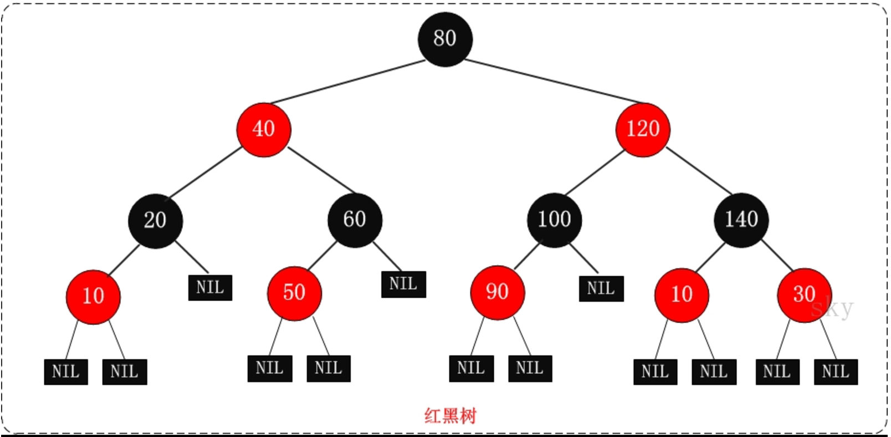
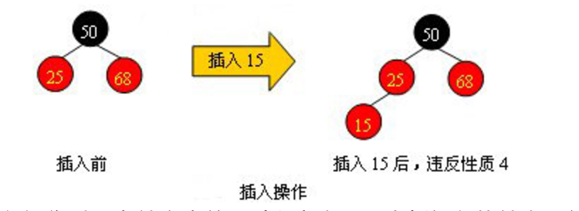
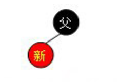
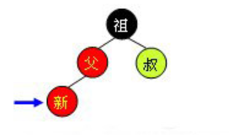
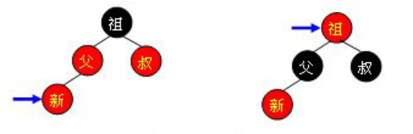
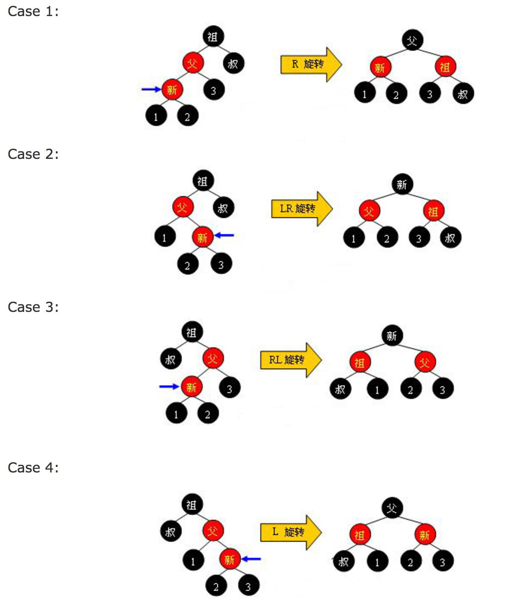
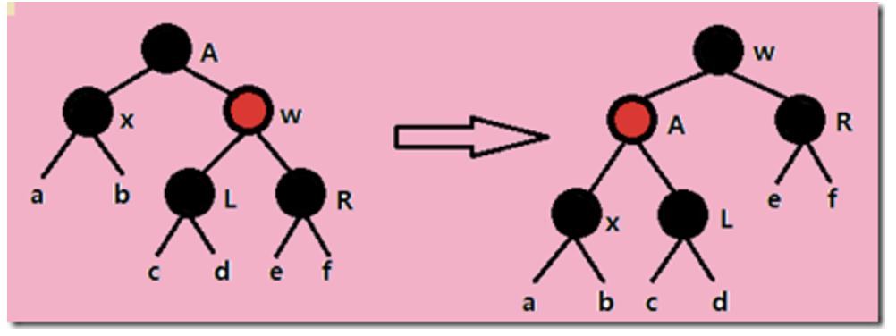
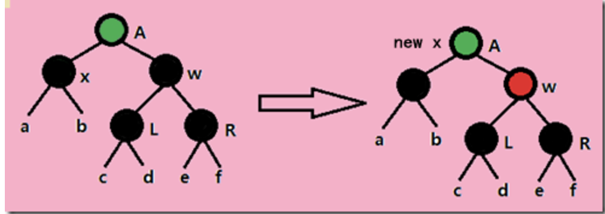
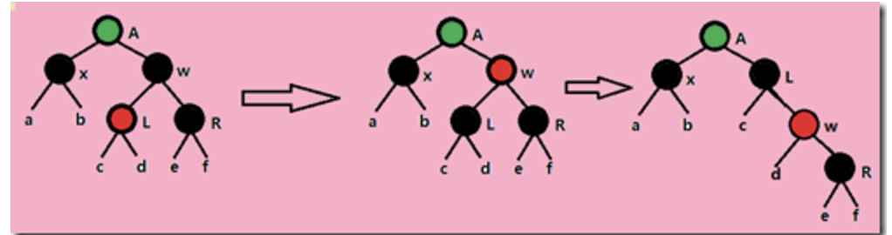
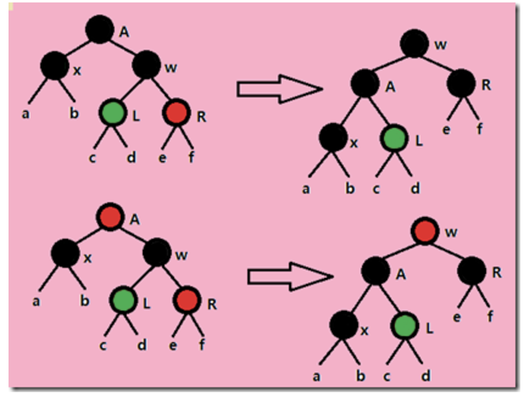

# <font color="red">红黑树</font>
<hr>
R-B Tree, 全称是Red-Black Tree, 又称为“红黑树”，它是一种特殊的二叉查找树。红黑树的每个节点上都有存储为表示节点的颜色，可以是红或黑。

红黑树的特性：<br>
（1）每个节点或者是黑色，或者是红色；<br>
（2）根节点时黑色；<br>
（3）每个叶子节点是黑色。[注意：这里的叶子节点，是指为空的叶子节点]<br>
（4）如果一个叶子节点是红色的，则它的字节点必须是黑色的。<br>
（5）从一个叶子节点到该节点的子孙叶节点的所有路径上包含相同数目的黑节点。<br>

红黑树示意图如下：


### 红黑树的应用
红黑树这种数据结构，主要用来存储有序的数据，它的时间复杂度是O(logn),效率非常之高。<br>
例如： Java集合中的TreeSet和TreeMap，C++STL中的set、map，以及linux虚拟内存的管理，都是通过红黑树实现的。


### 红黑树节点的插入
在讨论红黑树的插入操作之前必须要明白，任何一个即将插入的新结点的初始颜色都为红色。这一点很容易理解，因为插入黑点会增加某条路径上黑结点的数目，从而导致整棵树黑高度的不平衡。但如果新结点的父结点为红色时（如下图所示），将会违反红黑树的性质：一条路径上不能出现相邻的两个红色结点。这时就需要通过一系列操作来使红黑树保持平衡。


为了清楚地表示插入操作以下在结点中使用“新”字表示一个新插入的结点；使用“父”字表示新插入点的父结点；使用“叔”字表示“父”结点的兄弟结点；使用“祖”字表示“父”结点的父结点。插入操作分为以下几种情况：

<font color="blue">1 黑父</font><br>
如下图所示，如果新节点的父结点为黑色结点，那么插入一个红点将不会影响红黑树的平衡，此时插入操作完成。红黑树比AVL树优秀的地方之一在于黑父的情况比较常见，从而使红黑树需要旋转的几率相对AVL树来说会少一些。


<font color="blue">2 红父</font><br>
如果新节点的父结点为红色，这时就需要进行一系列操作以保证整棵树红黑性质。如下图所示，由于父结点为红色，此时可以判定，祖父结点必定为黑色。这时需要根据叔父结点的颜色来决定做什么样的操作。青色结点表示颜色未知。由于有可能需要根结点到新点的路径上进行多次旋转操作，而每次进行不平衡判断的起始点（我们可将其视为新点）都不一样。所以我们在此使用一个蓝色箭头指向这个起始点，并称之为判定点。


<font color="blue">红叔</font><br>
当叔父结点为红色时，如下图所示，无需进行旋转操作，只要将父和叔结点变为黑色，将祖父结点变为红色即可。但由于祖父结点的父结点有可能为红色，从而违反红黑树性质。此时必须将祖父结点作为新的判定点继续向上（迭代）进行平衡操作。

需要注意的是，无论“父节点”在“叔节点”的左边还是右边，无论“新节点”是“父节点”的左孩子还是右孩子，它们的操作都是完全一样的（其实这种情况包括4种，只需调整颜色，不需要旋转树形）。

<font color="blue">黑叔</font><br>
当叔父结点为黑色时，需要进行旋转，以下图示了所有的旋转可能：


可以观察到，当旋转完成后，新的旋转根全部为黑色，此时不需要再向上回溯进行平衡操作，插入操作完成。需要注意，上面四张图的“叔”、“1”、“2”、“3”结点有可能为黑哨兵结点。

其实红黑树的插入操作不是很难，甚至比AVL树的插入操作还更简单些。红黑树的插入操作源代码如下：

```c++
// 元素插入操作  insert_unique()  
// 插入新值：节点键值不允许重复，若重复则插入无效  
// 注意，返回值是个pair，第一个元素是个红黑树迭代器，指向新增节点  
// 第二个元素表示插入成功与否  
template<class Key , class Value , class KeyOfValue , class Compare , class Alloc>  
pair<typename rb_tree<Key , Value , KeyOfValue , Compare , Alloc>::iterator , bool>  
rb_tree<Key , Value , KeyOfValue , Compare , Alloc>::insert_unique(const Value &v)  
{  
    rb_tree_node* y = header;    // 根节点root的父节点  
    rb_tree_node* x = root();    // 从根节点开始  
    bool comp = true;  
    while(x != 0)  
    {  
        y = x;  
        comp = key_compare(KeyOfValue()(v) , key(x));    // v键值小于目前节点之键值？  
        x = comp ? left(x) : right(x);   // 遇“大”则往左，遇“小于或等于”则往右  
    }  
    // 离开while循环之后，y所指即插入点之父节点（此时的它必为叶节点）  
    iterator j = iterator(y);     // 令迭代器j指向插入点之父节点y  
    if(comp)     // 如果离开while循环时comp为真（表示遇“大”，将插入于左侧）  
    {  
        if(j == begin())    // 如果插入点之父节点为最左节点  
            return pair<iterator , bool>(_insert(x , y , z) , true);  
        else     // 否则（插入点之父节点不为最左节点）  
            --j;   // 调整j，回头准备测试  
    }  
    if(key_compare(key(j.node) , KeyOfValue()(v) ))  
        // 新键值不与既有节点之键值重复，于是以下执行安插操作  
        return pair<iterator , bool>(_insert(x , y , z) , true);  
    // 以上，x为新值插入点，y为插入点之父节点，v为新值  

    // 进行至此，表示新值一定与树中键值重复，那么就不应该插入新值  
    return pair<iterator , bool>(j , false);  
}  

// 真正地插入执行程序 _insert()  
template<class Key , class Value , class KeyOfValue , class Compare , class Alloc>  
typename<Key , Value , KeyOfValue , Compare , Alloc>::_insert(base_ptr x_ , base_ptr y_ , const Value &v)  
{  
    // 参数x_ 为新值插入点，参数y_为插入点之父节点，参数v为新值  
    link_type x = (link_type) x_;  
    link_type y = (link_type) y_;  
    link_type z;  

    // key_compare 是键值大小比较准则。应该会是个function object  
    if(y == header || x != 0 || key_compare(KeyOfValue()(v) , key(y) ))  
    {  
        z = create_node(v);    // 产生一个新节点  
        left(y) = z;           // 这使得当y即为header时，leftmost() = z  
        if(y == header)  
        {  
            root() = z;  
            rightmost() = z;  
        }  
        else if(y == leftmost())     // 如果y为最左节点  
            leftmost() = z;          // 维护leftmost()，使它永远指向最左节点  
    }  
    else  
    {  
        z = create_node(v);        // 产生一个新节点  
        right(y) = z;              // 令新节点成为插入点之父节点y的右子节点  
        if(y == rightmost())  
            rightmost() = z;       // 维护rightmost()，使它永远指向最右节点  
    }  
    parent(z) = y;      // 设定新节点的父节点  
    left(z) = 0;        // 设定新节点的左子节点  
    right(z) = 0;       // 设定新节点的右子节点  
    // 新节点的颜色将在_rb_tree_rebalance()设定（并调整）  
    _rb_tree_rebalance(z , header->parent);      // 参数一为新增节点，参数二为根节点root  
    ++node_count;       // 节点数累加  
    return iterator(z);  // 返回一个迭代器，指向新增节点  
}  
// 全局函数  
// 重新令树形平衡（改变颜色及旋转树形）  
// 参数一为新增节点，参数二为根节点root  
inline void _rb_tree_rebalance(_rb_tree_node_base* x , _rb_tree_node_base*& root)  
{  
    x->color = _rb_tree_red;    //新节点必为红  
    while(x != root && x->parent->color == _rb_tree_red)    // 父节点为红  
    {  
        if(x->parent == x->parent->parent->left)      // 父节点为祖父节点之左子节点  
        {  
            _rb_tree_node_base* y = x->parent->parent->right;    // 令y为伯父节点  
            if(y && y->color == _rb_tree_red)    // 伯父节点存在，且为红  
            {  
                x->parent->color = _rb_tree_black;           // 更改父节点为黑色  
                y->color = _rb_tree_black;                   // 更改伯父节点为黑色  
                x->parent->parent->color = _rb_tree_red;     // 更改祖父节点为红色  
                x = x->parent->parent;  
            }  
            else    // 无伯父节点，或伯父节点为黑色  
            {  
                if(x == x->parent->right)   // 如果新节点为父节点之右子节点  
                {  
                    x = x->parent;  
                    _rb_tree_rotate_left(x , root);    // 第一个参数为左旋点  
                }  
                x->parent->color = _rb_tree_black;     // 改变颜色  
                x->parent->parent->color = _rb_tree_red;  
                _rb_tree_rotate_right(x->parent->parent , root);    // 第一个参数为右旋点  
            }  
        }  
        else          // 父节点为祖父节点之右子节点  
        {  
            _rb_tree_node_base* y = x->parent->parent->left;    // 令y为伯父节点  
            if(y && y->color == _rb_tree_red)    // 有伯父节点，且为红  
            {  
                x->parent->color = _rb_tree_black;           // 更改父节点为黑色  
                y->color = _rb_tree_black;                   // 更改伯父节点为黑色  
                x->parent->parent->color = _rb_tree_red;     // 更改祖父节点为红色  
                x = x->parent->parent;          // 准备继续往上层检查  
            }  
            else    // 无伯父节点，或伯父节点为黑色  
            {  
                if(x == x->parent->left)        // 如果新节点为父节点之左子节点  
                {  
                    x = x->parent;  
                    _rb_tree_rotate_right(x , root);    // 第一个参数为右旋点  
                }  
                x->parent->color = _rb_tree_black;     // 改变颜色  
                x->parent->parent->color = _rb_tree_red;  
                _rb_tree_rotate_left(x->parent->parent , root);    // 第一个参数为左旋点  
            }  
        }  
    }//while  
    root->color = _rb_tree_black;    // 根节点永远为黑色  
}  


// 左旋函数  
inline void _rb_tree_rotate_left(_rb_tree_node_base* x , _rb_tree_node_base*& root)  
{  
    // x 为旋转点  
    _rb_tree_node_base* y = x->right;          // 令y为旋转点的右子节点  
    x->right = y->left;  
    if(y->left != 0)  
        y->left->parent = x;           // 别忘了回马枪设定父节点  
    y->parent = x->parent;  

    // 令y完全顶替x的地位（必须将x对其父节点的关系完全接收过来）  
    if(x == root)    // x为根节点  
        root = y;  
    else if(x == x->parent->left)         // x为其父节点的左子节点  
        x->parent->left = y;  
    else                                  // x为其父节点的右子节点  
        x->parent->right = y;  
    y->left = x;  
    x->parent = y;  
}  


// 右旋函数  
inline void _rb_tree_rotate_right(_rb_tree_node_base* x , _rb_tree_node_base*& root)  
{  
    // x 为旋转点  
    _rb_tree_node_base* y = x->left;          // 令y为旋转点的左子节点  
    x->left = y->right;  
    if(y->right != 0)  
        y->right->parent = x;           // 别忘了回马枪设定父节点  
    y->parent = x->parent;  

    // 令y完全顶替x的地位（必须将x对其父节点的关系完全接收过来）  
    if(x == root)  
        root = y;  
    else if(x == x->parent->right)         // x为其父节点的右子节点  
        x->parent->right = y;  
    else                                  // x为其父节点的左子节点  
        x->parent->left = y;  
    y->right = x;  
    x->parent = y;  
}  
```

### 删除

从红黑树上删除一个节点，可以先用普通二叉搜索树的方法，将节点从红黑树上删除掉，然后再将被破坏的红黑性质进行恢复。

我们回忆一下普通二叉树的节点删除方法：Z指向需要删除的节点，Y指向实质结构上被删除的结点，如果Z节点只有一个子节点或没有子节点，那么Y就是指向Z指向的节点。如果Z节点有两个子节点，那么Y指向Z节点的后继节点（其实前趋也是一样的），而Z的后继节点绝对不可能有左子树。因此，仅从结构来看，二叉树上实质被删除的节点最多只可能有一个子树。

现在我们来看红黑性质的恢复过程：
如果Y指向的节点是个红色节点，那么直接删除掉Y以后，红黑性质不会被破坏。操作结束。

如果Y指向的节点是个黑色节点，那么就有几条红黑性质可能受到破坏了。首先是包含Y节点的所有路径，黑高度都减少了一（第５条被破坏）。其次，如果Y的有红色子节点，Y又有红色的父节点，那么Y被删除后，就出现了两个相邻的红色节点（第４条被破坏）。最后，如果Y指向的是根节点，而Y的子节点又是红色的，那么Y被删除后，根节点就变成红色的了（第２条被破坏）。

其中，第５条被破坏是让我们比较难受的。因为这影响到了全局。这样动作就太大太复杂了。而且在这个条件下，进行其它红黑性质的恢复也很困难。所以我们首先解决这个问题：如果不改变含Y路径的黑高度，那么树的其它部分的黑高度就必须做出相应的变化来适应它。所以，我们想办法恢复原来含Y节点的路径的黑高度。做法就是：无条件的把Y节点的黑色，推到它的子节点X上去。（X可能是NIL节点）。这样，X就可能具有双重黑色，或同时具有红黑两色，也就是第１条性质被破坏了。

但第１条性质是比较容易恢复的：一、如果X是同时具有红黑两色，那么好办，直接把X涂成黑色，就行了。而且这样把所有问题都解决了。因为将X变为黑色，２、４两条如果有问题的话也会得到恢复，算法结束。二、如果X是双黑色，那么我们希望把这种情况向上推一直推到根节点（调整树结构和颜色，X的指向新的双黑色节点，X不断向上移动），让根节点具双黑色，这时，直接把X的一层黑色去掉就行了（因为根节点被包含在所有的路径上，所以这样做所有路径同时黑高减少一，不会破坏红黑特征）。

下面就具体地分析如何恢复1、２、４三个可能被破坏的红黑特性：我们知道，如果X指向的节点是有红黑两色，或是X是根节点时，只需要简单的对X进行一些改变就行了。要对除X节点外的其它节点进行操作时，必定是这样的情况：X节点是双层黑色，且X有父节点P。由知可知，X必然有兄弟节点W，而且这个W节点必定有两个子节点。（因为这是原树满足红黑条件要求而自然具备的。X为双黑色，那么P的另一个子节点以下一定要有至少两层的节点，否则黑色高度不可能和X路径一致）。所以我们就分析这些节点之间如何变形，把问题限制在比较小的范围内解决。另一个前提是：X在一开始，肯定是树底的叶节点或是NIL节点，所以在递归向上的过程中，每一步都保证下一步进行时，至少 X的子树是满足红黑特性的。因此子树的情况就可以认为是已经正确的了，这样，分析就只限制在X节点，X的父节点P和X的兄弟节点W，以及W的两个子节点中。

下面仅仅考虑X原本是黑色的情况即可。
在这种情况下，X此时应该具有双重黑色，算法的过程就是将这多出的一重黑色向上移动，直到遇到红节点或者根节点。

接着往下分析， 会遇到4种情况，实际上是8种， 因为其中4种是相互对称的，这可以通过判断X是其父节点的右孩子还是左孩子来区分。下面我们以X是其父节点的左孩子的情况来分析这4种情况，实际上接下来的调整过程，就是要想方设法将经过X的所有路径上的黑色节点个数增加1。

具体分为以下四种情况：（下面针对x是左儿子的情况讨论，右儿子对称）

Case1：X的兄弟W是红色（想办法将其变为黑色）

由于W是红色的，因此其儿子节点和父节点必为黑色，只要将W和其父节点的颜色对换，在对父节点进行一次左旋转，便将W的左子节点放到了X的兄弟节点上，X的兄弟节点变成了黑色，且红黑性质不变。但还不算完，只是暂时将情况1转变成了下面的情况2或3或4。


Case2：X的兄弟节点W是黑色的，而且W的两个子节点都是黑色的。此时可以将X的一重黑色和W的黑色同时去掉，而转加给他们的父节点上，这是X就指向它的父节点了，因此此时父节点具有双重颜色了。这一重黑色节点上移。


如果父节点原来是红色的，现在又加一层黑色，那么X现在指向的这个节点就是红黑两色的，直接把X（也就是父节点）着为黑色。问题就已经完整解决了。

如果父节点现在是双层黑色，那就以父节点为新的X进行向上的下一次的递归。

Case3：X的兄弟节点W是黑色的，而且W的左子节点是红色的，右子节点是黑色的。此时通过交换W和其左子节点的颜色并进行一次向右旋转就可转换成下面的第四种情况。注意，原来L是红色的，所以L的子节点一定是黑色的，所以旋转中L节点的一个子树挂到之后着为红色的W节点上不会破坏红黑性质。变形后黑色高度不变。


Case4：X的兄弟节点W是黑色的，而且W的右子节点是红色的。这种情况下，做一次左旋，W就处于根的位置，将W保持为原来的根的位置的颜色，同时将W的两个新的儿子节点的颜色变为黑色，去掉X的一重黑色。这样整个问题也就得到了解决。递归结束。（在代码上，为了标识递归结束，我们把X指向根节点）
上不会破坏红黑性质。变形后黑色高度不变。


因此，只要按上面四种情况一直递归处理下去，X最终总会指向根结点或一个红色结点，这时我们就可以结束递归并把问题解决了。

以上就是红黑树的节点删除全过程。

总结：

如果我们通过上面的情况画出所有的分支图，我们可以得出如下结论

插入操作：解决的是 红-红 问题<br>
删除操作：解决的是 黑-黑 问题<br>
即你可以从分支图中看出，需要往上遍历的情况为红红(插入)，或者为黑黑黑（删除）的情况，如果你认真分析并总结所有的情况后，并坚持下来，红黑树也就没有想象中的那么恐怖了，并且很美妙；

 详细的红黑树删除节点的代码如下：
 ```c++
 #include<iostream>  
using namespace std;  

// 定义节点颜色    
enum COLOR  
{    
    BLACK = 0,    
    RED    
};    

// 红黑树节点    
typedef struct RB_Tree_Node  
{    
    int key;    
    struct RB_Tree_Node *left;    
    struct RB_Tree_Node *right;    
    struct RB_Tree_Node *parent;    
    unsigned char RB_COLOR;    
}RB_Node;  

// 红黑树，包含一个指向根节点的指针    
typedef struct RBTree  
{    
    RB_Node* root;  
}*RB_Tree;  

// 红黑树的NIL节点    
static RB_Tree_Node NIL = {0, 0, 0, 0, BLACK};   

#define PNIL (&NIL)   // NIL节点地址   

void Init_RBTree(RB_Tree pTree) // 初始化一棵红黑树    
{    
    pTree->root = PNIL;    
}     

// 查找最小键值节点    
RB_Node* RBTREE_MIN(RB_Node* pRoot)    
{    
    while (PNIL != pRoot->left)  
    {  
        pRoot = pRoot->left;  
    }    
    return pRoot;  
}  


/*
                          15
                        /    \
                       /      \
                      /        \
                     6          18
                    /  \       /  \
                   /    \     /    \
                  3      7   17    20
                 /  \     \
                /    \     \
               2      4     13
                            /
                           /
                          9
*/  
// 查找指定节点的后继节点    
RB_Node* RBTREE_SUCCESSOR(RB_Node*  pRoot)    
{    
    if (PNIL != pRoot->right)    // 查找图中6的后继节点时就调用RBTREE_MIN函数  
    {    
        return RBTREE_MIN(pRoot->right);    
    }  
    // 节点没有右子树的时候，进入下面的while循环（如查找图中13的后继节点时，它的后继节点是15）  
    RB_Node* pParent = pRoot->parent;    
    while((PNIL != pParent) && (pRoot == pParent->right))  
    {    
        pRoot = pParent;  
        pParent = pRoot->parent;        
    }  
    return pParent;  
}  

// 红黑树的节点删除  
RB_Node* Delete(RB_Tree pTree , RB_Node* pDel)    
{    
    RB_Node* rel_delete_point;  
    if(pDel->left == PNIL || pDel->right == PNIL)  
        rel_delete_point = pDel;  
    else  
        rel_delete_point = RBTREE_SUCCESSOR(pDel);     // 查找后继节点  

    RB_Node* delete_point_child;    
    if(rel_delete_point->right != PNIL)    
    {    
        delete_point_child = rel_delete_point->right;    
    }    
    else if(rel_delete_point->left != PNIL)    
    {    
        delete_point_child = rel_delete_point->left;    
    }    
    else    
    {    
        delete_point_child = PNIL;    
    }    
    delete_point_child->parent = rel_delete_point->parent;    
    if(rel_delete_point->parent == PNIL)    // 删除的节点是根节点  
    {    
        pTree->root = delete_point_child;  
    }    
    else if(rel_delete_point == rel_delete_point->parent->right)  
    {    
        rel_delete_point->parent->right = delete_point_child;    
    }    
    else    
    {    
        rel_delete_point->parent->left = delete_point_child;    
    }  
    if(pDel != rel_delete_point)  
    {  
        pDel->key = rel_delete_point->key;  
    }  
    if(rel_delete_point->RB_COLOR == BLACK)    
    {    
        DeleteFixUp(pTree , delete_point_child);    
    }  
    return rel_delete_point;    
}    


/*
算法导论上的描述如下：
RB-DELETE-FIXUP(T, x)  
1 while x ≠ root[T] and color[x] = BLACK  
2     do if x = left[p[x]]  
3           then w ← right[p[x]]  
4                if color[w] = RED  
5                   then color[w] ← BLACK                           Case 1  
6                        color[p[x]] ← RED                          Case 1  
7                        LEFT-ROTATE(T, p[x])                       Case 1  
8                        w ← right[p[x]]                            Case 1  
9                if color[left[w]] = BLACK and color[right[w]] = BLACK  
10                   then color[w] ← RED                            Case 2  
11                        x p[x]                                    Case 2  
12                   else if color[right[w]] = BLACK  
13                           then color[left[w]] ← BLACK            Case 3  
14                                color[w] ← RED                    Case 3  
15                                RIGHT-ROTATE(T, w)                Case 3  
16                                w ← right[p[x]]                   Case 3  
17                         color[w] ← color[p[x]]                   Case 4  
18                         color[p[x]] ← BLACK                      Case 4  
19                         color[right[w]] ← BLACK                  Case 4  
20                         LEFT-ROTATE(T, p[x])                     Case 4  
21                         x ← root[T]                              Case 4  
22        else (same as then clause with "right" and "left" exchanged)  
23 color[x] ← BLACK   
*/    
//接下来的工作，很简单，即把上述伪代码改写成c++代码即可    
void DeleteFixUp(RB_Tree pTree , RB_Node* node)    
{    
    while(node != pTree->root && node->RB_COLOR == BLACK)    
    {    
        if(node == node->parent->left)    
        {    
            RB_Node* brother = node->parent->right;    
            if(brother->RB_COLOR==RED)   //情况1：x的兄弟w是红色的。    
            {    
                brother->RB_COLOR = BLACK;    
                node->parent->RB_COLOR = RED;    
                RotateLeft(node->parent);    
            }    
            else     //情况2：x的兄弟w是黑色的，    
            {    
                if(brother->left->RB_COLOR == BLACK && brother->right->RB_COLOR == BLACK)  //w的两个孩子都是黑色的    
                {    
                    brother->RB_COLOR = RED;    
                    node = node->parent;    
                }    
                else  
                {  
                    if(brother->right->RB_COLOR == BLACK)   //情况3：x的兄弟w是黑色的，w的右孩子是黑色（w的左孩子是红色）。    
                    {  
                        brother->RB_COLOR = RED;  
                        brother->left->RB_COLOR = BLACK;  
                        RotateRight(brother);  
                        brother = node->parent->right;      //情况3转换为情况4  
                    }  
                    //情况4：x的兄弟w是黑色的，且w的右孩子时红色的  
                    brother->RB_COLOR = node->parent->RB_COLOR;    
                    node->parent->RB_COLOR = BLACK;    
                    brother->right->RB_COLOR = BLACK;    
                    RotateLeft(node->parent);    
                    node = pTree->root;  
                }//else  
            }//else  
        }    
        else   //同上，原理一致，只是遇到左旋改为右旋，遇到右旋改为左旋即可。其它代码不变。    
        {    
            RB_Node* brother = node->parent->left;    
            if(brother->RB_COLOR == RED)    
            {    
                brother->RB_COLOR = BLACK;    
                node->parent->RB_COLOR = RED;    
                RotateRight(node->parent);    
            }    
            else    
            {    
                if(brother->left->RB_COLOR==BLACK && brother->right->RB_COLOR == BLACK)    
                {    
                    brother->RB_COLOR = RED;    
                    node = node->parent;    
                }    
                else  
                {  
                    if(brother->left->RB_COLOR==BLACK)    
                    {    
                        brother->RB_COLOR = RED;    
                        brother->right->RB_COLOR = BLACK;    
                        RotateLeft(brother);  
                        brother = node->parent->left;      //情况3转换为情况4  
                    }  
                    brother->RB_COLOR = node->parent->RB_COLOR;    
                    node->parent->RB_COLOR = BLACK;    
                    brother->left->RB_COLOR = BLACK;    
                    RotateRight(node->parent);    
                    node = pTree->root;    
                }    
            }    
        }    
    }//while   
    node->RB_COLOR = BLACK;    //如果X节点原来为红色，那么直接改为黑色    
}  
 ```
